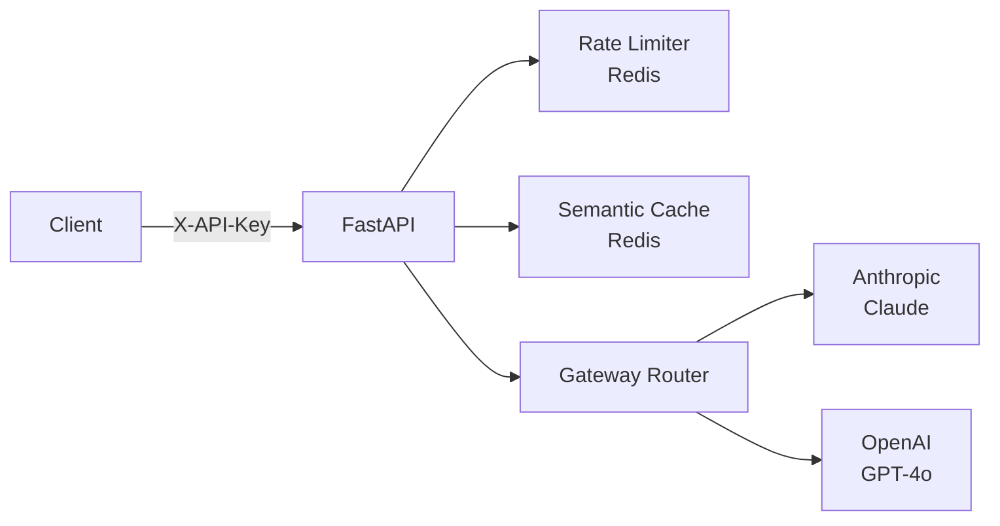

<div align="center">

# LLM Gateway

[](https://github.com/shaikn6/llm-gateway/actions)
[](https://python.org)
[](LICENSE)
[](docker-compose.yml)

**Production LLM gateway: OpenAI-compatible API + Redis caching + rate limiting + A/B testing — drop-in for direct LLM calls**

</div>

## Architecture



## Quick Start

```bash
git clone https://github.com/shaikn6/llm-gateway
cd llm-gateway && cp .env.example .env
docker compose up -d

curl http://localhost:8000/v1/chat/completions \
  -H "X-API-Key: dev-key-1" \
  -H "Content-Type: application/json" \
  -d '{"model": "claude-haiku-4-5", "messages": [{"role": "user", "content": "Hello"}]}'
```

## License
MIT
