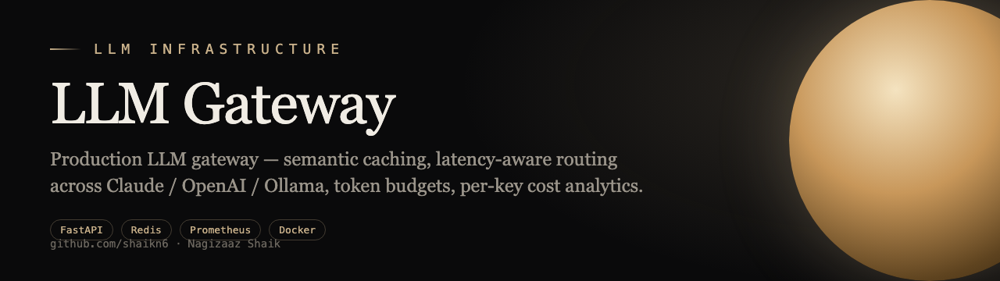
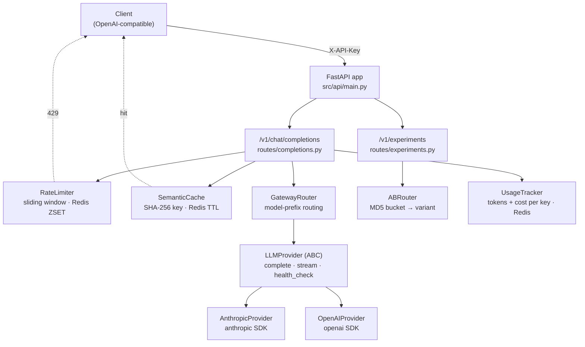

<p align="center"></p>

<div align="center">

# LLM Gateway

[](https://github.com/shaikn6/llm-gateway/actions)
[](https://python.org)
[](LICENSE)
[](docker-compose.yml)

**A single OpenAI-compatible endpoint in front of Anthropic and OpenAI — with Redis-backed caching, sliding-window rate limiting, deterministic A/B routing, and per-key cost tracking.**

</div>

A drop-in replacement for calling provider SDKs directly: point your existing OpenAI client at the gateway, and get vendor abstraction, response caching, rate limiting, traffic-split experiments, and token/cost accounting without touching application code.

## Architecture



All Redis-backed components (cache, rate limiter, usage tracker) share one Redis instance and degrade independently — a cache miss or limiter error never blocks a completion.

## How it works

The gateway is deliberately small and composable. Each concern is an isolated module so it can be tested, swapped, or disabled in isolation.

- **Provider abstraction (`src/providers/`).** `LLMProvider` is an `ABC` defining `complete()`, `stream()`, `list_models()`, and `health_check()`. Concrete providers (`AnthropicProvider`, `OpenAIProvider`) translate the OpenAI-style request/response into each vendor's native format — including system-prompt extraction, tool-call mapping, and the user/assistant alternation Anthropic requires. Upstream failures are normalized into a typed error hierarchy (`ProviderAuthError` → 401, `ProviderRateLimitError` → 429, `ProviderTimeoutError` → 504) so callers see consistent status codes regardless of vendor.

- **Routing (`src/gateway/router.py`).** `GatewayRouter` selects a provider by model-name prefix (`gpt*`/`o1*` → OpenAI, otherwise Anthropic). The OpenAI client is lazily constructed so an Anthropic-only deployment never needs an OpenAI key.

- **Deterministic A/B testing (`src/gateway/ab_router.py`).** Assignment is `MD5(experiment_id + user_id) % 100`, walked against cumulative `traffic_pct` buckets. Because it's a pure hash of stable inputs, the same user always lands in the same variant across requests and restarts — no assignment state to store or sync.

- **Response caching (`src/cache/semantic_cache.py`).** Cache keys are `SHA-256` of the canonicalized (`sort_keys`) message list, stored in Redis with a configurable TTL. Identical prompts return instantly and skip the provider call entirely.

- **Rate limiting (`src/middleware/rate_limiter.py`).** A true sliding window built on Redis sorted sets: each request is a `ZADD` with a timestamp score, expired entries are trimmed with `ZREMRANGEBYSCORE`, and the live `ZCARD` is compared to the limit. The check is pipelined to a single round trip and returns remaining quota.

- **Cost accounting (`src/middleware/usage_tracker.py`).** Per-key token usage is pushed to a Redis list; `get_usage()` aggregates input/output tokens and computes USD cost from a per-model price table (`COST_PER_1M`), broken down by model.

### Design decisions

| Decision | Rationale |
|----------|-----------|
| Hash-based cache key (not embeddings) | Exact-match caching is deterministic, dependency-free, and avoids false-positive cache hits on semantically-similar-but-different prompts. |
| MD5 bucketing for A/B | Stateless, reproducible assignment; no database, consistent across restarts. |
| Redis sorted-set rate limiter | Real sliding window (not fixed buckets), single pipelined round trip per check. |
| Typed provider error hierarchy | Vendor errors map to stable HTTP status codes so clients handle one contract. |
| Multi-stage Dockerfile, non-root user | Smaller production image, no build toolchain or root in the runtime layer. |

## Quick Start

```bash
git clone https://github.com/shaikn6/llm-gateway
cd llm-gateway && cp .env.example .env   # set ANTHROPIC_API_KEY / OPENAI_API_KEY
docker compose up -d                     # starts gateway + Redis

curl http://localhost:8000/v1/chat/completions \
  -H "X-API-Key: dev-key-1" \
  -H "Content-Type: application/json" \
  -d '{"model": "claude-3-5-haiku-20241022", "messages": [{"role": "user", "content": "Hello"}]}'
```

Local development without Docker:

```bash
pip install -e ".[dev]"
uvicorn src.api.main:app --reload --port 8000
pytest                    # 312 tests across 17 suites
ruff check . && mypy src  # lint + type-check
```

Configuration is environment-driven (`.env`): `ANTHROPIC_API_KEY`, `OPENAI_API_KEY`, `REDIS_URL`, `CACHE_ENABLED`, `API_KEYS` (comma-separated), `LOG_LEVEL`.

## Testing

The suite has **312 test functions across 17 files** (`tests/`), covering the provider adapters (including Anthropic message conversion and streaming), the A/B router's bucketing math, the sliding-window limiter, cache hit/miss paths, usage/cost aggregation, and the API endpoints. Run `pytest --cov=src` for coverage.

## Deployment

- **Docker Compose** — `docker-compose.yml` runs the gateway plus a `redis:7-alpine` sidecar.
- **Kubernetes** — manifests in `k8s/` (namespace, network policy) and a Helm chart in `helm/llm-gateway/` (deployment, HPA, ingress, service, Redis, secrets).

## API Reference

[](http://localhost:8000/docs)
[](http://localhost:8000/docs)
[](http://localhost:8000/redoc)

Interactive docs: `http://localhost:8000/docs` (Swagger UI) · `http://localhost:8000/redoc` (ReDoc)

| Method | Endpoint | Description |
|--------|----------|-------------|
| `GET` | `/health` | Health check — returns service version |
| `POST` | `/v1/chat/completions` | OpenAI-compatible chat completions (routes to Anthropic or OpenAI) |
| `GET` | `/v1/experiments` | List all A/B experiments |
| `POST` | `/v1/experiments` | Create a new A/B experiment |
| `GET` | `/v1/experiments/{experiment_id}/assignment` | Get model assignment for a user |

## Tech stack

Python 3.11 · FastAPI · Pydantic v2 · Redis (cache / rate limiter / usage) · `anthropic` & `openai` SDKs · Uvicorn · pytest · ruff · mypy · Docker · Helm / Kubernetes.

## License

MIT
