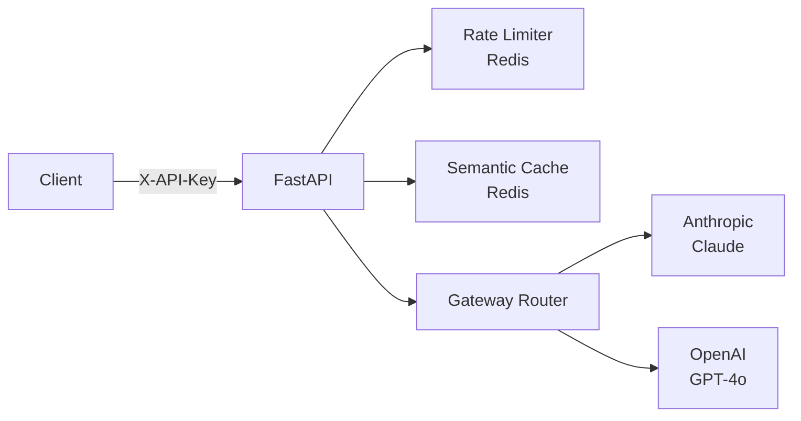

<p align="center"></p>

<div align="center">

# LLM Gateway

[](https://github.com/shaikn6/llm-gateway/actions)
[](https://python.org)
[](LICENSE)
[](docker-compose.yml)

**Production LLM gateway: OpenAI-compatible API + Redis caching + rate limiting + A/B testing — drop-in for direct LLM calls**

</div>

## Architecture



## Quick Start

```bash
git clone https://github.com/shaikn6/llm-gateway
cd llm-gateway && cp .env.example .env
docker compose up -d

curl http://localhost:8000/v1/chat/completions \
  -H "X-API-Key: dev-key-1" \
  -H "Content-Type: application/json" \
  -d '{"model": "claude-haiku-4-5", "messages": [{"role": "user", "content": "Hello"}]}'
```

## License
MIT

## API Reference

[](http://localhost:8000/docs)
[](http://localhost:8000/docs)
[](http://localhost:8000/redoc)

Interactive docs: `http://localhost:8000/docs` (Swagger UI) · `http://localhost:8000/redoc` (ReDoc)

| Method | Endpoint | Description |
|--------|----------|-------------|
| `GET` | `/health` | Health check — returns service version |
| `POST` | `/v1/chat/completions` | OpenAI-compatible chat completions (routes to Anthropic or OpenAI) |
| `GET` | `/v1/experiments` | List all A/B experiments |
| `POST` | `/v1/experiments` | Create a new A/B experiment |
| `GET` | `/v1/experiments/{experiment_id}/assignment` | Get model assignment for a user |
