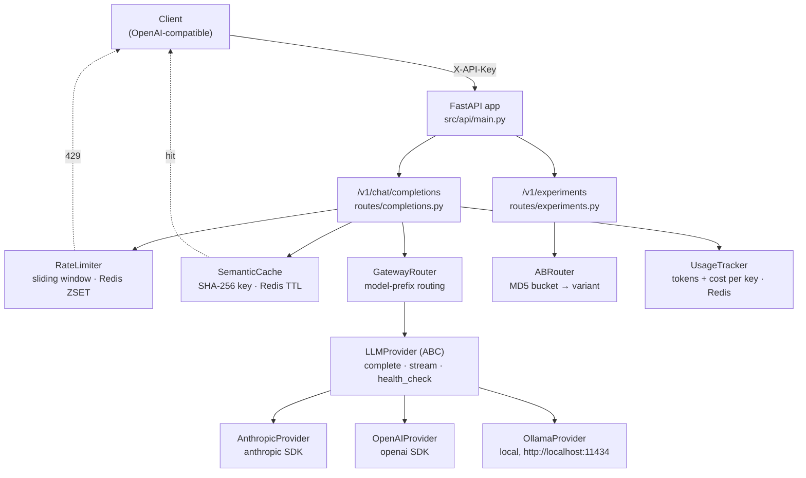

<p align="center"></p>

<div align="center">

# LLM Gateway

[](https://github.com/shaikn6/llm-gateway/actions)
[](https://python.org)
[](LICENSE)
[](docker-compose.yml)
[](tests/)
[](tests/)

**A single OpenAI-compatible endpoint in front of Anthropic, OpenAI, and local Ollama models — with Redis-backed caching, sliding-window rate limiting, deterministic A/B routing, and per-key cost tracking.**

</div>

A drop-in replacement for calling provider SDKs directly: point your existing OpenAI client at the gateway, and get vendor abstraction, response caching, rate limiting, traffic-split experiments, and token/cost accounting without touching application code.

## Architecture


```mermaid
flowchart TD
    Client["Client<br/>(OpenAI-compatible)"] -->|"X-API-Key"| API["FastAPI app<br/>src/api/main.py"]

    API --> Completions["/v1/chat/completions<br/>routes/completions.py"]
    API --> Experiments["/v1/experiments<br/>routes/experiments.py"]

    Completions --> RateLimit["RateLimiter<br/>sliding window · Redis ZSET"]
    Completions --> Cache["SemanticCache<br/>SHA-256 key · Redis TTL"]
    Completions --> Router["GatewayRouter<br/>model-prefix routing"]

    Experiments --> AB["ABRouter<br/>MD5 bucket → variant"]

    Router --> Base["LLMProvider (ABC)<br/>complete · stream · health_check"]
    Base --> Anthropic["AnthropicProvider<br/>anthropic SDK"]
    Base --> OpenAI["OpenAIProvider<br/>openai SDK"]
    Base --> Ollama["OllamaProvider<br/>local, http://localhost:11434"]

    Completions --> Usage["UsageTracker<br/>tokens + cost per key · Redis"]

    Cache -. hit .-> Client
    RateLimit -. 429 .-> Client
```

All Redis-backed components (cache, rate limiter, usage tracker) share one Redis instance. Usage tracking runs as a post-response background task, so it can't block or fail a completion. Cache and rate-limit checks, by contrast, run inline and are not currently wrapped in a fallback — a Redis outage surfaces as a `500` on `/v1/chat/completions` rather than degrading to "skip cache" or "skip limiting." Graceful degradation there is a known gap, not yet shipped behavior.

## How it works

The gateway is deliberately small and composable. Each concern is an isolated module so it can be tested, swapped, or disabled in isolation.

- **Provider abstraction (`src/providers/`).** `LLMProvider` is an `ABC` defining `complete()`, `stream()`, `list_models()`, and `health_check()`. Concrete providers (`AnthropicProvider`, `OpenAIProvider`, `OllamaProvider`) translate the OpenAI-style request/response into each vendor's native format — including system-prompt extraction, tool-call mapping, and the user/assistant alternation Anthropic requires. Upstream failures are normalized into a typed error hierarchy (`ProviderAuthError`, `ProviderRateLimitError`, `ProviderTimeoutError`), each carrying the HTTP status code it should map to (401 / 429 / 504 respectively) as a `status_code` attribute on `ProviderError`. `/v1/chat/completions` doesn't read that attribute yet — it currently catches all provider exceptions as a generic `500` — so today the hierarchy gives structured, typed errors internally without yet giving callers differentiated status codes.

- **Routing (`src/gateway/router.py`).** `GatewayRouter` selects a provider by model-name prefix: `ollama/*` → a local Ollama instance (`OLLAMA_BASE_URL`, default `http://localhost:11434`), `gpt*`/`o1*` → OpenAI, otherwise Anthropic. The `ollama/` namespace is explicit (same convention LiteLLM and other multi-provider gateways use) so an unrecognized model name still falls back to Anthropic rather than silently trying a local Ollama instance that may not be running. The OpenAI and Ollama clients are both lazily constructed so an Anthropic-only deployment never needs an OpenAI key or a running Ollama instance. All three providers (`AnthropicProvider`, `OpenAIAsyncProvider`, `OllamaProvider`) implement the same async `LLMProvider.complete(request: ChatCompletionRequest)` contract, and `/v1/chat/completions` awaits it directly — there is a single OpenAI provider implementation (`src/providers/openai.py`); the older, incompatible synchronous one has been removed.

- **Auth and rate limiting (`src/api/deps.py`).** Every request to `/v1/chat/completions` and `/v1/experiments/*` requires a valid `X-API-Key` header, checked against `API_KEYS` (comma-separated). A valid key is then passed through the sliding-window `RateLimiter`; requests over the configured quota get `429`.

- **Audit logging (`src/middleware/audit.py`).** `AuditMiddleware` emits one structured JSON line per request — `request_id` (reused from an inbound `X-Request-Id` or generated), method, path, status, latency, client IP, and a SHA-256 fingerprint of the API key. Prompt and completion content are never logged, at any level. `configure_logging()` routes the root logger through a single JSON handler on stdout, ready for Loki / CloudWatch without a parser.

- **Deterministic A/B testing (`src/gateway/ab_router.py`).** Assignment is `MD5(experiment_id + user_id) % 100`, walked against cumulative `traffic_pct` buckets. Because it's a pure hash of stable inputs, the same user always lands in the same variant across requests and restarts — no assignment state to store or sync.

- **Response caching (`src/cache/semantic_cache.py`).** Cache keys are `SHA-256` of the canonicalized (`sort_keys`) message list, stored in Redis with a configurable TTL. Identical prompts return instantly and skip the provider call entirely.

- **Rate limiting (`src/middleware/rate_limiter.py`).** A true sliding window built on Redis sorted sets: each request is a `ZADD` with a timestamp score, expired entries are trimmed with `ZREMRANGEBYSCORE`, and the live `ZCARD` is compared to the limit. The check is pipelined to a single round trip and returns remaining quota.

- **Cost accounting (`src/middleware/usage_tracker.py`).** Per-key token usage is pushed to a Redis list; `get_usage()` aggregates input/output tokens and computes USD cost from a per-model price table (`COST_PER_1M`), broken down by model.

### Design decisions

| Decision | Rationale |
|----------|-----------|
| Hash-based cache key (not embeddings) | Exact-match caching is deterministic, dependency-free, and avoids false-positive cache hits on semantically-similar-but-different prompts. |
| MD5 bucketing for A/B | Stateless, reproducible assignment; no database, consistent across restarts. |
| Redis sorted-set rate limiter | Real sliding window (not fixed buckets), single pipelined round trip per check. |
| Typed provider error hierarchy | Vendor errors are distinguishable in code by type, each pre-annotated with the status code it should surface as; wiring that into the API's error response is the next step. |
| Multi-stage Dockerfile, non-root user | Smaller production image, no build toolchain or root in the runtime layer. |
| Metadata-only audit log (JSON, one line/request) | Full request accounting for operators without ever persisting prompt or completion content — the sensitive surface for an LLM gateway. |

## Quick Start

```bash
git clone https://github.com/shaikn6/llm-gateway
cd llm-gateway && cp .env.example .env   # set ANTHROPIC_API_KEY / OPENAI_API_KEY
docker compose up -d                     # starts gateway + Redis

curl http://localhost:8000/v1/chat/completions \
  -H "X-API-Key: dev-key-1" \
  -H "Content-Type: application/json" \
  -d '{"model": "claude-3-5-haiku-20241022", "messages": [{"role": "user", "content": "Hello"}]}'
```

Local development without Docker:

```bash
pip install -e ".[dev]"
uvicorn src.api.main:app --reload --port 8000
pytest                    # 328 tests across 17 suites
ruff check .              # lint (CI-gated; mypy is unpinned/advisory, not yet CI-gated)
```

Configuration is environment-driven (`.env`): `ANTHROPIC_API_KEY`, `OPENAI_API_KEY`, `OLLAMA_BASE_URL` (default `http://localhost:11434`), `REDIS_URL`, `CACHE_ENABLED`, `API_KEYS` (comma-separated), `LOG_LEVEL`.

## Testing

The suite has **328 test functions across 17 files** (`tests/`), covering the provider adapters (including Anthropic message conversion and streaming, and the `ollama/*` routing prefix), the A/B router's bucketing math, the sliding-window limiter, cache hit/miss paths, usage/cost aggregation, the audit-log middleware (JSON shape, inbound request-id reuse, key fingerprint not raw key, no prompt content in any record), and the API endpoints — including an integration test that exercises the real, unmocked `AnthropicProvider.complete()` coroutine through the live route (stubbing only the outermost Anthropic SDK call), so a regression to a synchronous provider-calling convention fails loudly instead of being masked by an over-permissive mock. Line coverage on `src/` is currently 99% (`pytest --cov=src --cov-report=term-missing`).

## Deployment

- **Docker Compose** — `docker-compose.yml` runs the gateway plus a `redis:7-alpine` sidecar.
- **Kubernetes** — manifests in `k8s/` (namespace, network policy) and a Helm chart in `helm/llm-gateway/` (deployment, HPA, ingress, service, Redis, secrets).

## API Reference

[](http://localhost:8000/docs)
[](http://localhost:8000/docs)
[](http://localhost:8000/redoc)

Interactive docs: `http://localhost:8000/docs` (Swagger UI) · `http://localhost:8000/redoc` (ReDoc)

| Method | Endpoint | Auth | Description |
|--------|----------|------|-------------|
| `GET` | `/health` | — | Health check — returns service version |
| `POST` | `/v1/chat/completions` | `X-API-Key` | OpenAI-compatible chat completions (routes to Anthropic, OpenAI, or Ollama) |
| `GET` | `/v1/experiments` | `X-API-Key` | List all A/B experiments |
| `POST` | `/v1/experiments` | `X-API-Key` | Create a new A/B experiment |
| `GET` | `/v1/experiments/{experiment_id}/assignment` | `X-API-Key` | Get model assignment for a user |

Auth is enforced on every protected route — a request with a missing or unrecognized `X-API-Key` is rejected before it reaches the router, cache, or rate limiter:

```bash
$ curl -s -w '\nHTTP %{http_code}\n' http://localhost:8000/v1/chat/completions \
  -H "Content-Type: application/json" \
  -d '{"model": "claude-haiku-4-5", "messages": [{"role": "user", "content": "Hello"}]}'

{"detail":"Invalid or missing X-API-Key"}
HTTP 401
```

## Security

An LLM gateway is a high-value target: it holds provider API keys, brokers every
prompt and completion in the system, and is where per-caller cost and rate
controls actually live. This section states what the gateway enforces, what it
deliberately delegates, and what is not yet covered.

### Threat model

| Asset | Threat | Control in this repo |
|-------|--------|----------------------|
| Provider API keys (Anthropic / OpenAI) | Leak via source, image layers, or logs | Keys only via env / `.env` (git-ignored) or a mounted `Secret`; never request/response-logged; multi-stage Docker build keeps them out of image layers |
| `/v1/chat/completions` and `/v1/experiments/*` | Unauthenticated use → provider-cost abuse | `X-API-Key` checked against the `API_KEYS` allowlist in `require_api_key` (`src/api/deps.py`); missing/unknown → `401` *before* the router, cache, or rate limiter is touched |
| The gateway as a whole | Volumetric abuse / DoS from one caller | Redis sliding-window rate limiter (`src/middleware/rate_limiter.py`), keyed per API key, single pipelined round trip; over quota → `429` |
| Prompt / completion content | Exposure through operational logging | `AuditMiddleware` records request metadata only — prompt and completion bodies are never written, at any log level (`tests/test_audit.py` asserts a known secret in a request body never appears in any emitted record) |
| Cost attribution | One caller's spend attributed to another | Usage tracked per API key (`src/middleware/usage_tracker.py`); audit log ties each request to a key fingerprint |
| Container runtime | Privilege escalation from a compromised process | Dockerfile runs as a non-root user with no build toolchain in the runtime layer |
| Dependencies | Known-vuln transitive packages | Exact-pinned `ruff`, CI lint gate, Dependabot on the repo |

### Encryption

| Path | Posture |
|------|---------|
| Client → gateway | TLS terminated at the ingress / load balancer (`helm/llm-gateway/` ingress). The app speaks plain HTTP only on the pod network and is never exposed directly. |
| Gateway → providers | HTTPS enforced by the `anthropic` / `openai` SDKs (TLS 1.2+). |
| Gateway → Redis | `REDIS_URL` accepts `rediss://` (TLS); use in-transit encryption plus an ACL / `requirepass` for any non-loopback Redis. |
| At rest | The gateway is stateless. Redis holds only cache entries, rate-limit counters, and usage counters — no prompt content; if persistence is enabled it should sit on an encrypted volume. Kubernetes `Secret`s should be backed by KMS-encrypted etcd or an external secrets store. |

### Audit logging

`AuditMiddleware` (`src/middleware/audit.py`) emits exactly one structured JSON
line per request:

```json
{"ts":"2026-08-27T20:08:33-0400","level":"INFO","logger":"llm_gateway.audit",
 "msg":"request","request_id":"1576c79e-…","method":"POST",
 "path":"/v1/chat/completions","status":200,"latency_ms":0.6,
 "client":"10.0.1.7","api_key":"1bcefe2243ec"}
```

- **Correlatable** — `request_id` comes from an inbound `X-Request-Id` or is
  generated, so a gateway record joins to upstream and downstream traces.
- **Attributable, not sensitive** — `api_key` is a SHA-256 fingerprint (first 12
  hex chars), never the raw key.
- **Content-free** — method, path, status, latency, caller only. Prompt and
  completion text are never logged.
- **Shippable** — single-line JSON on stdout via `configure_logging()`, ready for
  Loki / CloudWatch / Elastic without a parser.

### Not yet covered

Tracked here rather than left implicit:

- **Key management** — API keys are a static env allowlist: no per-key scopes,
  rotation, expiry, or revocation without a redeploy. A real deployment should
  front this with an API gateway / IdP issuing short-lived credentials.
- **Hard per-key quotas** — usage is *measured* per key but not *enforced* as a
  spend cap; the rate limiter is the only guardrail today.
- **Provider error differentiation** — the typed error hierarchy exists but
  `/v1/chat/completions` still returns a generic `500` for provider failures
  (see *How it works*).
- **PII redaction** — the gateway does not inspect or scrub prompt content.

### Reporting a vulnerability

See [`SECURITY.md`](SECURITY.md). Report privately to **nagizaazs@gmail.com** —
do not open a public issue.

## Tech stack

Python 3.11 · FastAPI · Pydantic v2 · Redis (cache / rate limiter / usage) · `anthropic` & `openai` SDKs · Uvicorn · pytest · ruff · mypy · Docker · Helm / Kubernetes.

## License

MIT
