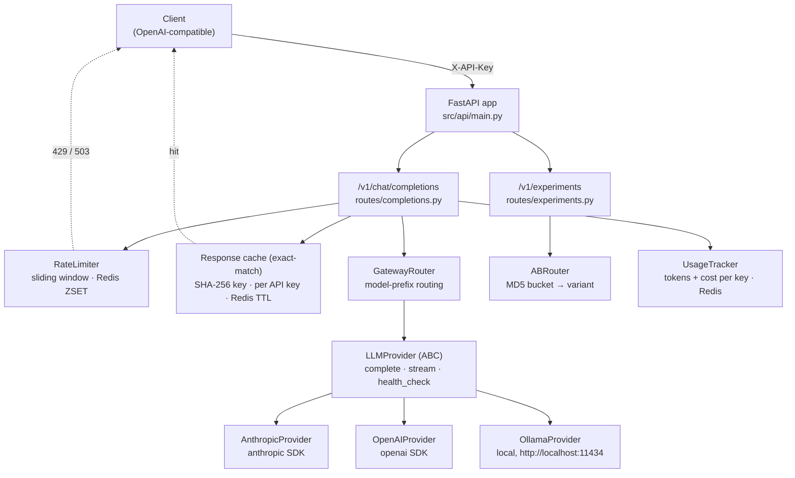

<p align="center"></p>

<div align="center">

# LLM Gateway

[](https://github.com/shaikn6/llm-gateway/actions)
[](https://python.org)
[](LICENSE)
[](docker-compose.yml)
[](tests/)
[](tests/)

**A single OpenAI-compatible endpoint in front of Anthropic, OpenAI, and local Ollama models — with exact-match response caching, sliding-window rate limiting, deterministic A/B routing, and per-key cost tracking, all backed by Redis.**

</div>

Instead of calling provider SDKs directly, send OpenAI-shaped chat-completion requests to the gateway and get vendor abstraction, response caching, rate limiting, traffic-split experiments, and token/cost accounting in one place. It is deliberately a subset of the OpenAI API: non-streaming chat completions only, authenticated with an `X-API-Key` header (an OpenAI SDK client needs that header added; `Authorization: Bearer` is not read).

## Architecture


```mermaid
flowchart TD
    Client["Client<br/>(OpenAI-compatible)"] -->|"X-API-Key"| API["FastAPI app<br/>src/api/main.py"]

    API --> Completions["/v1/chat/completions<br/>routes/completions.py"]
    API --> Experiments["/v1/experiments<br/>routes/experiments.py"]

    Completions --> RateLimit["RateLimiter<br/>sliding window · Redis ZSET"]
    Completions --> Cache["Response cache (exact-match)<br/>SHA-256 key · per API key · Redis TTL"]
    Completions --> Router["GatewayRouter<br/>model-prefix routing"]

    Experiments --> AB["ABRouter<br/>MD5 bucket → variant"]

    Router --> Base["LLMProvider (ABC)<br/>complete · stream · health_check"]
    Base --> Anthropic["AnthropicProvider<br/>anthropic SDK"]
    Base --> OpenAI["OpenAIProvider<br/>openai SDK"]
    Base --> Ollama["OllamaProvider<br/>local, http://localhost:11434"]

    Completions --> Usage["UsageTracker<br/>tokens + cost per key · Redis"]

    Cache -. hit .-> Client
    RateLimit -. 429 / 503 .-> Client
```

All Redis-backed components (cache, rate limiter, usage tracker) share one Redis instance, and each has a defined behaviour when Redis is unreachable:

| Component | Redis unreachable | Why |
|-----------|-------------------|-----|
| Rate limiter | **Fails closed**: `503` with `Retry-After: 5` on every authenticated route | A quota that cannot be checked is not enforced; letting requests through unmetered would turn a Redis outage into unbounded provider spend. |
| Response cache | **Degrades to a miss**; writes are skipped | The cache is an optimisation, not a dependency. |
| Usage tracker | The record is dropped with a warning | It runs after the response is sent and must not fail a served completion. |

Because all three share one Redis, a full outage is seen by callers as the limiter's `503`; the cache and usage paths matter when only those calls fail. `/health` and the `401` for a bad key do not touch Redis. The Redis clients use redis-py's default socket timeouts, so an unreachable-but-not-refusing Redis (a black-holed network path) is not bounded by the gateway yet.

## How it works

The gateway is deliberately small and composable. Each concern is an isolated module so it can be tested, swapped, or disabled in isolation.

- **Provider abstraction (`src/providers/`).** `LLMProvider` is an `ABC` defining `complete()`, `stream()`, `list_models()`, and `health_check()`. Concrete providers (`AnthropicProvider`, `OpenAIProvider`, `OllamaProvider`) translate the OpenAI-style request/response into each vendor's native format — including system-prompt extraction, tool-call mapping, and the user/assistant alternation Anthropic requires. Upstream failures are normalized into a typed error hierarchy (`ProviderAuthError`, `ProviderRateLimitError`, `ProviderTimeoutError`, all `ProviderError`). `/v1/chat/completions` maps them to gateway statuses: an upstream timeout is `504`, any other upstream failure (4xx, 5xx, bad or missing provider credentials) is `502`, and anything unexpected is `500`. The response body is always a fixed generic message — the upstream status and exception type go to the log, the exception text goes nowhere.

  Sampling parameters are forwarded only when the caller set them. `anthropic` 1.x removed `temperature` / `top_p` from `messages.create()`, so for Anthropic they are sent through the SDK's `extra_body` (the SDK's documented path for models that still honour them); whether a given Claude model accepts them is decided upstream and has not been tested here against the live API. `tests/test_sdk_contract.py` binds the exact kwargs each provider builds against the real installed SDK signatures, so a removed or renamed SDK parameter fails CI instead of failing every request in production.

- **Routing (`src/gateway/router.py`).** `GatewayRouter` selects a provider by model-name prefix: `ollama/*` → a local Ollama instance (`OLLAMA_BASE_URL`, default `http://localhost:11434`), `gpt*`/`o1*` → OpenAI, otherwise Anthropic. The `ollama/` namespace is explicit (same convention LiteLLM and other multi-provider gateways use) so an unrecognized model name still falls back to Anthropic rather than silently trying a local Ollama instance that may not be running. The OpenAI and Ollama clients are both lazily constructed so an Anthropic-only deployment never needs an OpenAI key or a running Ollama instance. All three providers (`AnthropicProvider`, `OpenAIAsyncProvider`, `OllamaProvider`) implement the same async `LLMProvider.complete(request: ChatCompletionRequest)` contract, and `/v1/chat/completions` awaits it directly — there is a single OpenAI provider implementation (`src/providers/openai.py`); the older, incompatible synchronous one has been removed.

- **Auth and rate limiting (`src/api/deps.py`).** Every request to `/v1/chat/completions` and `/v1/experiments/*` requires a valid `X-API-Key` header, checked against `API_KEYS` (comma-separated). There is no default key: with `API_KEYS` empty the process refuses to start, unless `GATEWAY_DEV_MODE=true` is set, which accepts the built-in `dev-key-1` / `dev-key-2` for local work. A valid key is then passed through the sliding-window `RateLimiter`; requests over the configured quota get `429`, and `503` if the limiter's Redis is unreachable.

- **Audit logging (`src/middleware/audit.py`).** `AuditMiddleware` emits one structured JSON line per request — `request_id` (reused from an inbound `X-Request-Id` or generated), method, path, status, latency, client IP, and a SHA-256 fingerprint of the API key. Prompt and completion content are never logged, at any level. `configure_logging()` routes the root logger through a single JSON handler on stdout, ready for Loki / CloudWatch without a parser.

- **Deterministic A/B testing (`src/gateway/ab_router.py`).** Assignment is `MD5(experiment_id + user_id) % 100`, walked against cumulative `traffic_pct` buckets. Because it's a pure hash of stable inputs, the same user always lands in the same variant across requests and restarts — no assignment state to store or sync. The experiment *definitions* are a different matter: they live in process memory only, so they are lost on restart and are not shared between workers or replicas. Variant `traffic_pct` values must be integers in 0–100 that sum to exactly 100; anything else is a `422`.

- **Response caching (`src/cache/semantic_cache.py`).** An exact-match cache, not a semantic one — the `SemanticCache` class name is historical and there are no embeddings or similarity search. The key is a `SHA-256` over the canonicalized (`sort_keys`) request — provider, model, messages, `max_tokens`, `temperature`, `top_p`, `stop` — prefixed with a fingerprint of the caller's API key, stored in Redis with a configurable TTL. A hit therefore needs the same caller sending a byte-identical request; a different model, parameter, or API key is a miss, and one caller can never be served another's cached answer.

- **Rate limiting (`src/middleware/rate_limiter.py`).** A true sliding window built on Redis sorted sets: each request is a `ZADD` with a timestamp score, expired entries are trimmed with `ZREMRANGEBYSCORE`, and the live `ZCARD` is compared to the limit. The check is pipelined to a single round trip and returns remaining quota.

- **Cost accounting (`src/middleware/usage_tracker.py`).** Per-key token usage is pushed to a Redis list; `get_usage()` aggregates input/output tokens and computes USD cost from a per-model price table (`COST_PER_1M`), broken down by model.

### Design decisions

| Decision | Rationale |
|----------|-----------|
| Hash-based cache key (not embeddings) | Exact-match caching is deterministic, dependency-free, and avoids false-positive cache hits on semantically-similar-but-different prompts. |
| MD5 bucketing for A/B | Stateless, reproducible assignment; no database, consistent across restarts. |
| Redis sorted-set rate limiter | Real sliding window (not fixed buckets), single pipelined round trip per check. |
| Typed provider error hierarchy, generic client errors | Vendor errors are distinguishable in code and logs by type and upstream status; callers only ever see `502` / `504` with a fixed message, so upstream error text cannot leak through the gateway. |
| Reject unsupported request fields | `stream`, `tools`, and any other field the gateway does not forward are a `422` naming the field, rather than being accepted and silently dropped. |
| Fail closed when the limiter's Redis is down | See the outage table above. |
| Multi-stage Dockerfile, non-root user | Smaller production image, no build toolchain or root in the runtime layer. |
| Metadata-only audit log (JSON, one line/request) | Full request accounting for operators without ever persisting prompt or completion content — the sensitive surface for an LLM gateway. |

## Quick Start

This runs the gateway natively against a local Redis and `scripts/fake_upstream.py`, a standard-library stand-in for the Anthropic and OpenAI APIs — no provider keys, no network calls, no cost. Needs Python 3.11+ and `redis-server` on the `PATH`.

```bash
git clone https://github.com/shaikn6/llm-gateway
cd llm-gateway
python3.11 -m venv .venv
.venv/bin/pip install -e ".[dev]"

redis-server --port 6390 --save "" --appendonly no &
.venv/bin/python scripts/fake_upstream.py 9099 &

export GATEWAY_KEY=$(openssl rand -hex 24)
API_KEYS=$GATEWAY_KEY \
REDIS_URL=redis://127.0.0.1:6390/0 \
ANTHROPIC_API_KEY=not-a-real-key \
ANTHROPIC_BASE_URL=http://127.0.0.1:9099 \
.venv/bin/uvicorn src.api.main:app --port 8000 &
```

Then, once uvicorn reports it is running:

```bash
curl -s -w '\nHTTP %{http_code}\n' http://127.0.0.1:8000/health

curl -s -w '\nHTTP %{http_code}\n' http://127.0.0.1:8000/v1/chat/completions \
  -H "X-API-Key: $GATEWAY_KEY" -H "Content-Type: application/json" \
  -d '{"model": "claude-haiku-4-5", "messages": [{"role": "user", "content": "Hello"}]}'
```

Repeat the second command and vary it. The fake upstream numbers its replies, so a cache hit shows up as a repeated number:

| Request | Status | Reply |
|---------|--------|-------|
| `GET /health` | `200` | `{"status":"ok","version":"1.1.0"}` |
| the completion above | `200` | `fake reply #1 from claude-haiku-4-5` |
| the same request again | `200` | `fake reply #1 …` — cache hit, upstream not called |
| `"model": "claude-sonnet-4-6"` | `200` | `fake reply #2 …` — different model, cache miss |
| `"messages": []` | `422` | validation error on `messages` |
| `-H "X-API-Key: wrong"` | `401` | `{"detail":"Invalid or missing X-API-Key"}` |

Stop the three background processes with `kill %1 %2 %3`.

To use the real providers, set real `ANTHROPIC_API_KEY` / `OPENAI_API_KEY` values and leave `ANTHROPIC_BASE_URL` unset. Nothing in this repository's tests or CI calls a live provider API, so that path is exercised only through the real SDK request code against a fake transport.

```bash
.venv/bin/pytest --cov=src --cov-report=term-missing --cov-fail-under=95   # 415 passed, 99% line coverage
.venv/bin/ruff check src/ tests/                                           # lint (CI-gated; mypy is unpinned/advisory, not CI-gated)
```

Configuration is environment-driven (`.env`, see `.env.example`):

| Variable | Default | Notes |
|----------|---------|-------|
| `API_KEYS` | — (required) | Comma-separated client keys. Empty means the gateway will not start. |
| `GATEWAY_DEV_MODE` | `false` | `true` allows starting without `API_KEYS` and accepts `dev-key-1` / `dev-key-2`. Local use only. |
| `ANTHROPIC_API_KEY`, `OPENAI_API_KEY` | empty | Provider credentials. A request routed to a provider with no key gets `502`. |
| `OLLAMA_BASE_URL` | `http://localhost:11434` | |
| `REDIS_URL` | `redis://localhost:6379/0` | |
| `CACHE_ENABLED` | `true` | |
| `LOG_LEVEL` | `INFO` | |

## Testing

`pytest` collects **415 tests** (381 test functions, some parametrized) across 19 files in `tests/`. Line coverage on `src/` is 99% (`pytest --cov=src --cov-report=term-missing`; CI fails under 95%). Redis is mocked throughout, and no test opens a network connection.

Beyond the provider adapters, the A/B bucketing math, the sliding-window limiter, usage/cost aggregation and the audit log, the suite pins down the behaviours that are easy to get wrong:

- **SDK contract** (`tests/test_sdk_contract.py`) — the kwargs each provider builds are bound against the real installed `anthropic` / `openai` method signatures, and a completion is driven through the real SDK request path against an in-process fake transport. Mocked SDK clients accept any keyword argument; these tests do not.
- **Cache isolation** (`tests/test_cache_isolation.py`) — identical request is a hit; a different model, provider, parameter, message, or API key is a miss.
- **Validation, error mapping, Redis outage, experiment weights** (`tests/test_api_hardening.py`) — `422` for empty or malformed messages and for unsupported fields, `502` / `504` with no upstream text in the body, `503` + `Retry-After` when the limiter's Redis is down, cache and usage failures not failing the request.
- **Startup guard** (`tests/test_config.py`) — no keys and no dev flag means `Settings()` raises.

## Deployment

- **Docker Compose** — `docker-compose.yml` runs the gateway plus `redis:7-alpine`; Redis has a healthcheck and the gateway waits for it (`depends_on: condition: service_healthy`). The image has a `HEALTHCHECK` on `/health`. Copy `.env.example` to `.env` and set `API_KEYS` first — it ships empty and the container exits until it is set. The compose file is validated with `docker compose config`; the image build runs in CI (`docker-build` job).
- **Kubernetes** — manifests in `k8s/` (namespace, network policy) and a Helm chart in `helm/llm-gateway/` (deployment, HPA, ingress, service, Redis, secrets). **No image is published for the chart** — CI builds the image but does not push it, so `image.repository` in `values.yaml` is a placeholder: build and push your own image and set `image.repository` (and `image.tag`, which defaults to the chart's `appVersion`). The chart reads the client keys from the `gateway-api-keys` entry of its Secret (`externalSecrets.remoteRefs.gatewayApiKeys`); pods will not start without it. The chart passes `helm lint` and renders with `helm template`; it has not been installed on a cluster as part of this repo's checks.

## API Reference

[](http://localhost:8000/docs)
[](http://localhost:8000/docs)
[](http://localhost:8000/redoc)

Interactive docs: `http://localhost:8000/docs` (Swagger UI) · `http://localhost:8000/redoc` (ReDoc)

| Method | Endpoint | Auth | Description |
|--------|----------|------|-------------|
| `GET` | `/health` | — | Health check — returns service version |
| `POST` | `/v1/chat/completions` | `X-API-Key` | Chat completions in the OpenAI request/response shape (routes to Anthropic, OpenAI, or Ollama). Non-streaming only. |
| `GET` | `/v1/experiments` | `X-API-Key` | List all A/B experiments |
| `POST` | `/v1/experiments` | `X-API-Key` | Create a new A/B experiment (in-memory; `traffic_pct` must sum to 100) |
| `GET` | `/v1/experiments/{experiment_id}/assignment` | `X-API-Key` | Get model assignment for a user |

`/v1/chat/completions` accepts `model`, `messages` (at least one), `max_tokens` (default 1024), `temperature`, `top_p`, `stop`, and `stream: false`. Every other field — including `stream: true`, `tools`, `tool_choice`, `response_format`, `n` — is rejected with a `422` that names it. Status codes: `200`, `401` (bad or missing key), `422` (invalid request), `429` (over quota), `502` (upstream error), `503` (rate limiter unavailable), `504` (upstream timeout).

Auth is enforced on every protected route — a request with a missing or unrecognized `X-API-Key` is rejected before it reaches the router, cache, or rate limiter:

```bash
$ curl -s -w '\nHTTP %{http_code}\n' http://localhost:8000/v1/chat/completions \
  -H "Content-Type: application/json" \
  -d '{"model": "claude-haiku-4-5", "messages": [{"role": "user", "content": "Hello"}]}'

{"detail":"Invalid or missing X-API-Key"}
HTTP 401
```

## Security

An LLM gateway is a high-value target: it holds provider API keys, brokers every
prompt and completion in the system, and is where per-caller cost and rate
controls actually live. This section states what the gateway enforces, what it
deliberately delegates, and what is not yet covered.

### Threat model

| Asset | Threat | Control in this repo |
|-------|--------|----------------------|
| Provider API keys (Anthropic / OpenAI) | Leak via source, image layers, or logs | Keys only via env / `.env` (git-ignored) or a mounted `Secret`; never request/response-logged; multi-stage Docker build keeps them out of image layers |
| `/v1/chat/completions` and `/v1/experiments/*` | Unauthenticated use → provider-cost abuse | `X-API-Key` checked against the `API_KEYS` allowlist in `require_api_key` (`src/api/deps.py`); missing/unknown → `401` *before* the router, cache, or rate limiter is touched. No built-in default key: the process refuses to start with `API_KEYS` empty unless `GATEWAY_DEV_MODE=true` |
| Cached completions | One caller reading another's cached answer | Cache key is scoped by a fingerprint of the caller's API key and covers provider, model and every forwarded parameter (`tests/test_cache_isolation.py`) |
| Upstream error text | Provider error bodies leaking to callers | Provider failures surface as a fixed `502` / `504` message; exception text is never put in a response |
| The gateway as a whole | Volumetric abuse / DoS from one caller | Redis sliding-window rate limiter (`src/middleware/rate_limiter.py`), keyed per API key, single pipelined round trip; over quota → `429`; Redis unreachable → fails closed with `503` |
| Prompt / completion content | Exposure through operational logging | `AuditMiddleware` records request metadata only — prompt and completion bodies are never written, at any log level (`tests/test_audit.py` asserts a known secret in a request body never appears in any emitted record) |
| Cost attribution | One caller's spend attributed to another | Usage tracked per API key (`src/middleware/usage_tracker.py`); audit log ties each request to a key fingerprint |
| Container runtime | Privilege escalation from a compromised process | Dockerfile runs as a non-root user with no build toolchain in the runtime layer |
| Dependencies | Known-vuln transitive packages; breaking SDK releases | Exact-pinned `ruff`, `anthropic` / `openai` capped below the next major, SDK contract tests, CI lint gate, Dependabot on the repo |

### Encryption

| Path | Posture |
|------|---------|
| Client → gateway | TLS terminated at the ingress / load balancer (`helm/llm-gateway/` ingress). The app speaks plain HTTP only on the pod network and is never exposed directly. |
| Gateway → providers | HTTPS enforced by the `anthropic` / `openai` SDKs (TLS 1.2+). |
| Gateway → Redis | `REDIS_URL` accepts `rediss://` (TLS); use in-transit encryption plus an ACL / `requirepass` for any non-loopback Redis. |
| At rest | The gateway is stateless. Redis holds cache entries (which contain completion text, under a hashed key — prompts themselves are not stored), rate-limit counters, and usage counters; if persistence is enabled it should sit on an encrypted volume. Kubernetes `Secret`s should be backed by KMS-encrypted etcd or an external secrets store. |

### Audit logging

`AuditMiddleware` (`src/middleware/audit.py`) emits exactly one structured JSON
line per request:

```json
{"ts":"2026-08-27T20:08:33-0400","level":"INFO","logger":"llm_gateway.audit",
 "msg":"request","request_id":"1576c79e-…","method":"POST",
 "path":"/v1/chat/completions","status":200,"latency_ms":0.6,
 "client":"10.0.1.7","api_key":"1bcefe2243ec"}
```

- **Correlatable** — `request_id` comes from an inbound `X-Request-Id` or is
  generated, so a gateway record joins to upstream and downstream traces.
- **Attributable, not sensitive** — `api_key` is a SHA-256 fingerprint (first 12
  hex chars), never the raw key.
- **Content-free** — method, path, status, latency, caller only. Prompt and
  completion text are never logged.
- **Shippable** — single-line JSON on stdout via `configure_logging()`, ready for
  Loki / CloudWatch / Elastic without a parser.

### Not yet covered

Tracked here rather than left implicit:

- **Key management** — API keys are a static env allowlist: no per-key scopes,
  rotation, expiry, or revocation without a redeploy. A real deployment should
  front this with an API gateway / IdP issuing short-lived credentials.
- **Hard per-key quotas** — usage is *measured* per key but not *enforced* as a
  spend cap; the rate limiter is the only guardrail today.
- **Streaming and tool calling** — not supported through the HTTP API; such
  requests are rejected with `422` rather than partially honoured.
- **Upstream `429` passthrough** — a provider rate limit is reported as `502`,
  without the provider's `Retry-After`.
- **PII redaction** — the gateway does not inspect or scrub prompt content.

### Reporting a vulnerability

See [`SECURITY.md`](SECURITY.md). Report privately to **nagizaazs@gmail.com** —
do not open a public issue.

## Tech stack

Python 3.11 · FastAPI · Pydantic v2 · Redis (cache / rate limiter / usage) · `anthropic` & `openai` SDKs · Uvicorn · pytest · ruff · mypy · Docker · Helm / Kubernetes.

## License

MIT
